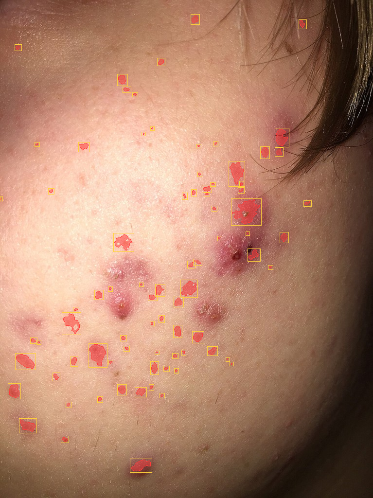

# VisionDerm

Full-stack skin analysis web app. FastAPI + React 19 that detects and outlines
acne lesions in a photo, counts them, and estimates severity. Ships a
dependency-free classical CV pipeline (LAB a* top-hat redness + Haar face
gating) with a pluggable engine interface for trained models.



*Example overlay returned by `POST /api/segment` — detected lesions tinted red
with bounding boxes.*

> **Demonstration only — not a medical device.** Severity is a heuristic index,
> not a validated clinical grade. Do not use this for diagnosis or treatment.

## Stack

| Layer      | Tech |
|------------|------|
| Backend    | FastAPI + Uvicorn (Python 3.14), Pydantic v2 |
| Inference  | Classical CV pipeline — OpenCV + scikit-image + NumPy (default, no model download) |
| Optional ML| PyTorch + `segmentation-models-pytorch` U-Net (auto-used if a checkpoint exists) |
| Frontend   | React 19 + Vite + TypeScript + Tailwind CSS v4 |
| Data       | Wikimedia Commons (CC-licensed) acne photos + synthetic fallback |

## Quick start

### One command

```powershell
./run.ps1        # Windows
```
```bash
./run.sh         # macOS / Linux
```

This creates the venv, installs deps, fetches sample images, and starts both
servers. Then open **http://localhost:5173**.

### Manual

```bash
# --- backend ---
cd backend
python -m venv .venv
.venv/Scripts/python -m pip install -r requirements.txt      # Windows
# source .venv/bin/activate && pip install -r requirements.txt   # macOS/Linux
python data/fetch_samples.py
python -m pytest                                             # 9 tests
python -m uvicorn app.main:app --reload --port 8000          # API + docs at /docs

# --- frontend (second terminal) ---
cd frontend
npm install
npm run dev                                                  # http://localhost:5173
```

## How the classical pipeline works

`backend/app/segmentation/classical.py`, per image:

1. **Skin / face region** — YCrCb+HSV skin gate, intersected with an OpenCV Haar
   face box (expanded) when a face is found, so hair, clothing and background
   are excluded.
2. **CIE L\*a\*b\*** — acne lesions are locally elevated on **a\*** (redness).
3. **Two redness maps** — a local *top-hat* on a\* (isolates small rounded bumps
   even on an already-flushed cheek) plus a cheek-scale *median-background*
   difference (larger patches). Shadow / stubble is damped via an L\* gate.
4. **Threshold** at `mean + sensitivity·std` over skin pixels, with an absolute
   a\*-contrast floor. `sensitivity` is the UI slider.
5. **Morphology** open/close, small-object removal.
6. **Connected components** with area + shape (eccentricity, solidity, aspect)
   and per-region colour gates → per-lesion masks, centroids, boxes, scores.
7. **Severity** — GAGS-inspired band (Clear / Mild / Moderate / Severe) from
   lesion count and fraction of skin area involved.

It is a fast, deterministic **approximation**. It does well on close-up facial
skin photos and degrades on odd white balance, heavy beard shadow, or wide
shots. For higher accuracy, train the U-Net (`backend/ml/README.md`).

## API

| Method | Path | Purpose |
|--------|------|---------|
| POST | `/api/segment` | multipart `image` + `sensitivity`, `min_area`, `max_area`, `engine`, `draw_boxes` → JSON with lesions, count, severity, base64 mask + overlay PNGs |
| GET  | `/api/samples` | list bundled sample images (+ source/license) |
| GET  | `/api/samples/{file}` | fetch one sample |
| GET  | `/api/health` | status + whether the U-Net checkpoint is present |

Interactive docs: **http://localhost:8000/docs**

## Optional: train the U-Net

See [`backend/ml/README.md`](backend/ml/README.md). After training,
`backend/models/unet.pt` is picked up automatically and the engine badge in the
UI switches to **U-Net**.

## Project layout

```
backend/
  app/            FastAPI app, routes, segmentation engines, overlay rendering
  ml/             optional U-Net training (dataset.py, train_unet.py)
  data/           fetch_samples.py + downloaded/synthetic samples
  tests/          pytest — classical pipeline + API contract
frontend/
  src/components/ Dropzone, SampleGallery, ImageCanvas, Controls, ResultsPanel
  src/api.ts      typed backend client
```

## Data & licensing

`backend/data/fetch_samples.py` downloads facial-acne photographs from Wikimedia
Commons and records each file's source URL and CC license in
`backend/data/samples/credits.json`. When a download fails it generates a
synthetic face with procedurally-placed lesions so the app and tests always have
data. The **ACNE04** dataset referenced for U-Net training is *academic use
only*.
